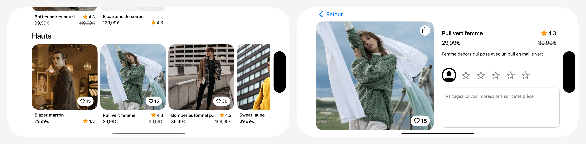

# OpenClassrooms : Créez une interface dynamique et accessible

Ce projet fait partie du parcours "Développeur d'application iOS" d'OpenClassrooms (projet 12).

L'objectif de ce projet était de concevoir et de développer une application mobile en veillant à respecter les normes d'accessibilité iOS. L'application devait garantir une expérience utilisateur accessible à tous, en intégrant des fonctionnalités adaptées aux personnes en situation de handicap, telles que la compatibilité avec VoiceOver, des contrastes optimisés et une ergonomie fluide.

# Captures d'écran de l'application

